Funzionalità di amministrazione del Catasto Strade
====================================================

Le funzionalità di creazione/gestione di eventi sono possibili solo per il profili di
tipo 1 e 2 (*Amministratore di sistema* e *Responsabile Centrale PC*).

I progetti QGIS
------------------------

Il principio fondamentale su cui si basa il sistema informativo del catasto strade è la possibilità di gestire tramite l'utilizzo di Qgis desktop la pubblicazione e la visualizzazione dei dati sul web. Questo può essere fatto in due modi:

* impostando opportunamente le proprietà del progetto Qgis e dei singoli layer da pubblicare;
* impostando opportunatamente le diverse opzioni proposte dal plugin Lizmap.

A seconda dei diversi contenuti che si vogliono visualizzare on-line, sono stati creati diversi progetti Qgis ognuno corrispondente a una diversa interfaccia web. Qualora si volesse creare un nuovo progetto e quindi la corrispondente visualizzazione web, sarà sufficiente creare appunto un nuovo progetto Qgis, caricare i dati da pubblicare al suo interno, impostare le proprietà del progetto e dei singoli layer e infine utilizzare il plugin Lizmap per procedere alla pubblicazione. In automatico verrà creata la pagina web corrispondente al progetto con tutte le caratteristiche definite tramite le proprietà di Qgis e il plugin Lizmap.
Un eventuale nuovo progetto deve essere salvato all'interno della cartella NuovoCS dove sono state create due cartelle:

* progetti_pubblici: i progetti salvati in questa cartella e configurati per la pubblicazione su web sono accessibili a chiunque accedendo all'interfaccia web;
* progetti_privati: i progetti salvati in questa cartella e configurati per la pubblicazione su web sono accessibili solo attraverso opportune password.

Come già accennato, molte delle caratteristiche dell'interfaccia web possono essere definite impostando le proprietà del progetto e/o dei singoli layer direttamente da Qgis

Proprietà del progetto
"""""""""""""""""""""""""""""""""""""""""""
In Qgis dal menù Progetto selezionare la voce Proprietà, si aprirà una finestra di dialogo da cui selezionare la voce 'Qgis server'

Da qui si possono impostare diverse proprietà che verranno poi trasferite all'interfaccia web salvando il progetto stesso. In particolare da qui è possibile definire:

* Capabilities del Servizio:
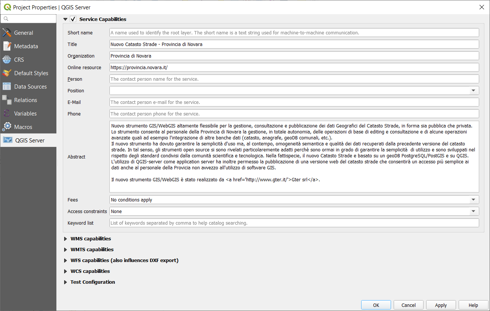
Si tratta di informazioni generali, come il titolo dello strumento webGIS (che può essere diverso da quello del file di progetto Qgis), i dati dell'ente e della persona di riferimento, una breve descrizione, ecc.
Le informazioni inserite in questa finestra di dialogo saranno trasferite allo strumento web una volta salvato il progetto, e saranno visibili cliccando sul pulsante 'Informazioni' nella toolbar alla sinistra dello schermo.

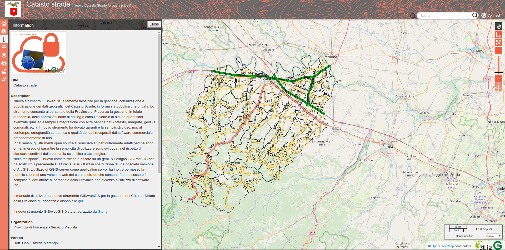

* Capabilities dei servizi WMS:
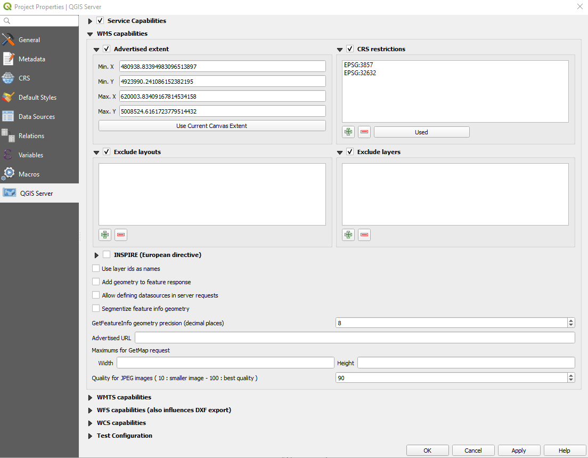
Da qui è possibile impostare l'estensione della mappa da visualizzare on line, i codici EPSG supportati dai servizi WMS, escludere determinati layer e layout di stampa dalla visualizzazione web, ecc.

* Capabilities dei servizi WMTS:
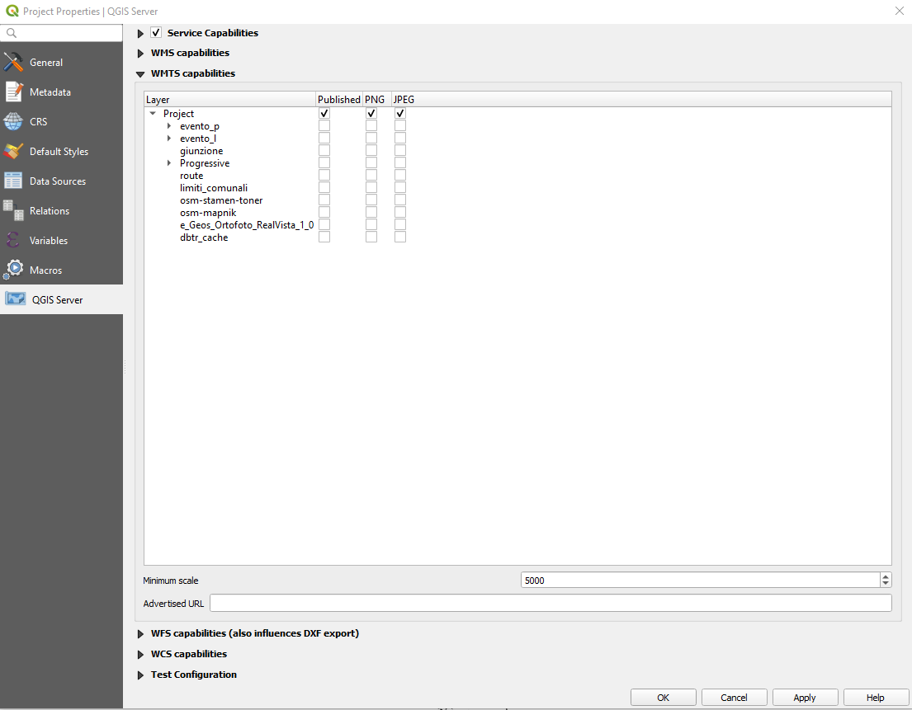
Da qui si abilita l'interrogazione dei diversi layer che verranno pubblicati e visualizzati visualizzati nello strumento webGIS. Spuntando le caselle in corrispondenza del progetto tutti i layer caricati al suo interno saranno interrogabili lato web. Agendo invece sui singoli layer sarà invece possibile definire quali rendere interrogabili sul web e quali no.

* Capabilities dei servizi WFS:
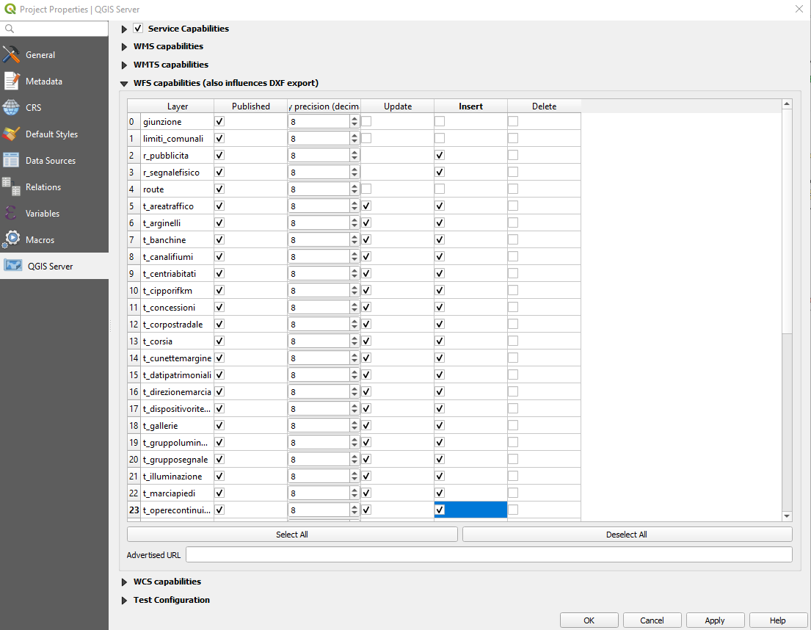
Da qui si abilita la pubblicazione dei singoli layer come servizi WFS. Questo passaggio è necessario per poter utilizzare alcuni tools propri dello strumento webGIS quali l'editing on line sia delle geometrie che delle tabelle associate, e la ricerca.
Anche in questo caso è possibile definire quali layer pubblicare come WFS e quali no. Spuntando le diverse caselle in corrispondenza di ogni layer si abilita la pubblicazione come WFS, la modifica, l'inserimento e la rimozione delle geometrie e le relative informazioni alfanumeriche.

Proprietà del layer
"""""""""""""""""""""""""""""""""""""""""""
Una volta caricati i dati all'interno del progetto Qgis, siano essi vettoriali, raster, altri servizi WMS, ecc., vengono visualizzati all'interno del pannello Layers (a sinistra).
L'ordine con cui vengono disposti i diversi layer all'interno del pannello Layers determina l'ordine con cui saranno disposti i diversi layer nell'albero dei layer dell'interfaccia web (si vedano immagini sotto.) Inoltre l'ordine dei layer determina anche l'ordine di visualizzazione in caso di sovrapposizione delle geometrie. In Qgis infatti, il primo layer dall'alto è quello che si sovrappone a tutti gli altri che seguono.

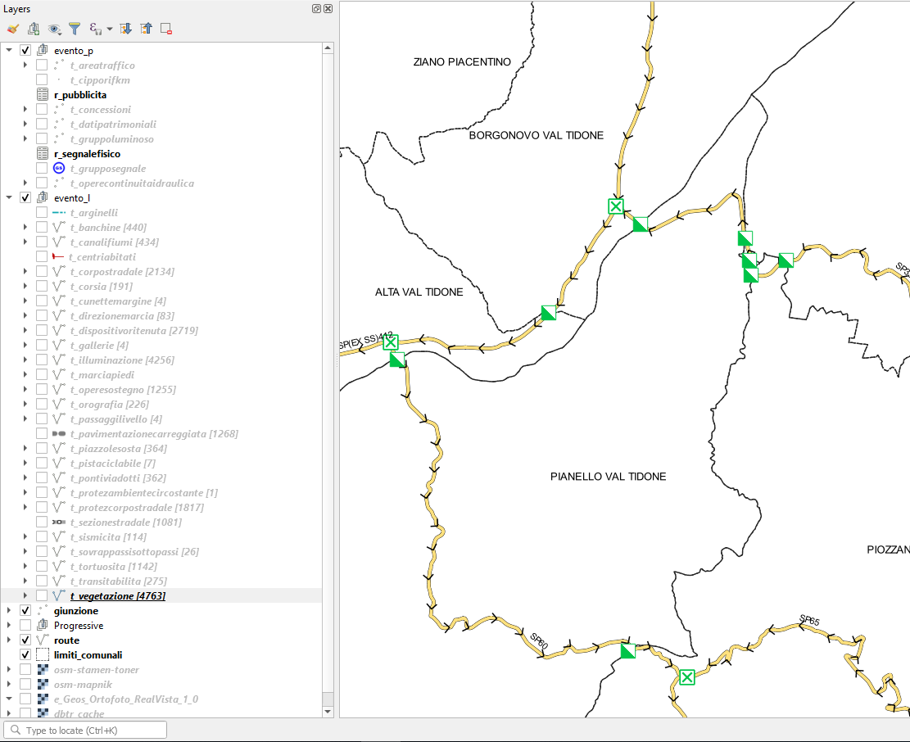

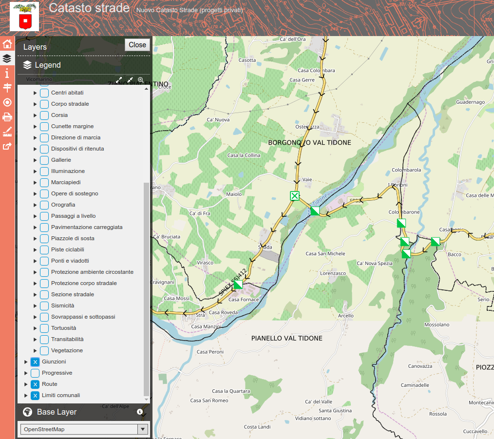

Nell'esempio delle immagine sopra, il layer 'giunzioni' si sovrappone infatti al layer 'route' e 'limiti_comunali'.

Cliccando con il tasto destro del mouse su un singolo layer si accede ad un menù dal quale selezionare la voce Proprietà. Da qui si aprirà una finestra da cui sarà possibile impostare le caratteristtiche principali del layer (es. stile di rappresentazione, limiti di scala nella visualizzazione, caratteristiche della tabella associata per i dati vettoriali, ecc.) che verranno immediatamente trasferite alinterfaccia web salvando il progetto stesso e utilizzando il plugin lizmap.

In particolare dalle proprietà del layer è possibile definire:

* Stile: da questo menù è possibile impostare lo stile grafico con cui verranno rappresentate le geometrie del layer. Si possono creare stili molto semplici ma anche molto complessi, basati ad esempio sui valori univoci di una colonna della relativa tabella degli attributi o definire regole specifiche, ad esempio per modificare la rappresentazione delle geometrie a seconda del livello di zoom di visualizzazione. Qualsiasi stile definito, dal più semplice al più complesso, verrà trasferito allo strumento webGIS una volta salvato il progetto Qgis.

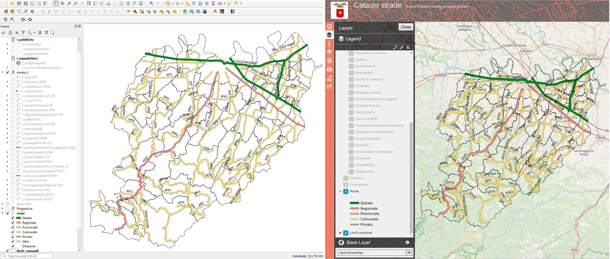

* Etichette: da questo menù è possibile definire le caratteristiche grafiche e i contenuti delle etichette associate alle singole geometrie del layer. Anche in questo caso si possono creare etichette molto semplici (es. scegliendo una colonna della tabella associata come contenuto dell'etichetta) o più complesse (es. utilizzando espressioni e query sui dati per definirne il contenuto). Impostate le varie caratteristiche delle etichette che si vogliono visualizzare (es. contenuto, dimensioni, posizionamento limiti di scala, ecc.) queste saranno trasferite allo strumento webGIS salvando il progetto Qgis.

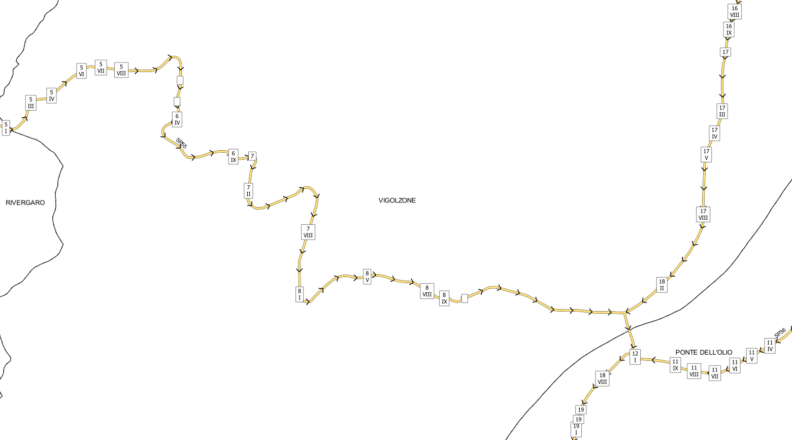

Ad esempio nel caso del layer dei Cippi di riferimento chilometrico la rappresentazione dell'evento puntuale è data dalla sola etichetta.

* Proprietà dei campi della tabella: da questo menù è possibile consultare le proprietà dei campi che compongono la tabella associata al layer (es. nome, tipologia, dimensione, ecc.). Da qui è possibile aggiungere o rimuovere colonne ma soprattutto, ai fini della pubblicazione web dei dati, è possibile stabilire quali colonne saranno visibili on line interrogando i dati. Per evitare che una o più colonne compaiano nel risultato dell'interrogazione di un elemento sul web è sufficiente deselezionare la casella corrispondente nella colonna 'WMS'.

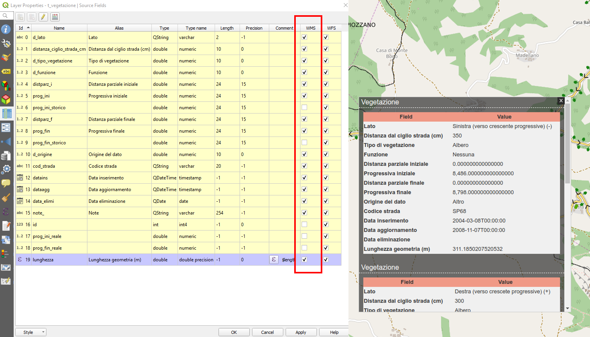

* Tipologia dei campi della tabella: da questo menù è possibile definire la tipologia della colonna e il metodo di inserimento dei valori. La scelta della tipologia più appropriata per la singola colonna può essere molto importante sia per rendere la consultazione dei dati più semplice, come nel caso delle colonne a cui associare la corrispondente tabella di decodifica, sie per rendere l'editing della tabella più semplice per l'operatore, sia lato desktop che web.

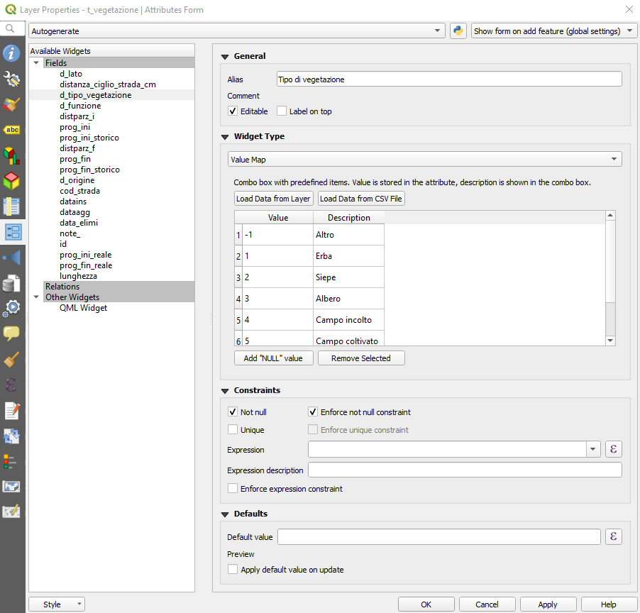

Ad esempio per le colonne di decodifica si è scelta la tipologia 'Mappa Valore' che consente di associare ai valori della colonna quelli della tabella di decodifica, in questo modo in fase di editing sarà sufficiente scegliere la voce desiderata dal menù a tendina che comparirà selezionando la cella che si vuole editare, invece che inserire manualmente il codice numerico o alfanumerico corrispondente alla decodifica.

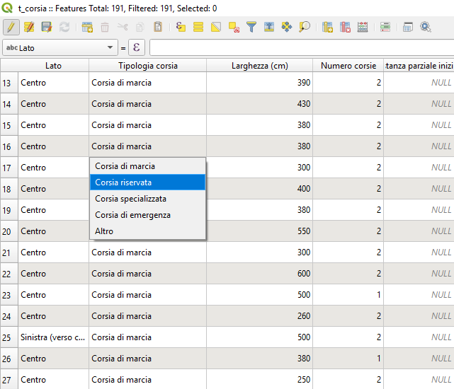

Altre tipologie utilizzate sono ad esempio 'Modifica testo' che permette di scrivere manualmente all'interno della cella selezionata, 'Data/Ora' che consente di inserire testi in formato data selezionandoli direttamente da un calendario che comparirà selezionando la cella, 'Nascosto' che permette di nascondere la colonna in fase di editing del dato.
Da qui inoltre è possibile definire se una colonna è modificabile, se può contenere valori nulli, un alias per il nome della colonna, ecc.
Anche in questo caso tutte le caratteristiche definite per le singole colonne della tabella associata al singolo layer saranno trasferite allo strumento webGIS una volta salvato il progetto Qgis.

* Visualizzazione: da questo menù è possibile limitare la visualizzazione del layer a un certo range di scala. Ad esempio la visualizzazione degli eventi puntuali è stata impostata tra la scala 1:25000 e 1:1 mentre quella degli eventi lineari tra 1:50000 e 1:1. Ciò significa che per scale maggiori dell'1:25000 non sarà possibile visualizzare e interrogare i layers degli eventi puntuali mentre per scale superiori all'1:50000 non sarà possibile visualizzare e interrogare i layers degli eventi lineari.
Anche in questo caso eventuali limiti di visualizzazione dipendenti dalla scala per i singoli layers saranno trasferiti allo strumento webGIS una volta salvato il progetto Qgis.

Il plugin lizmap
-----------------------------------
Un altro strumento che consente di gestire la pubblicazione e visualizzazione web dei dati tramite Qgis è il plugin Lizmap che può essere facilmente installato dal menù plugin.
Il plugin Lizmap consente di impostare tutte le proprietà, strumenti, e funzioni che non vengono già impostate tramite le proprietà del progetto o dei layer, infatti dal qui si definiscono soprattutto le caratteristiche dello strumento webGIS.
Una volta terminata la configurazione, tramite le varie opzioni del plugin Lizmap, si devono applicare le impostazioni definite cliccando sul pulsante 'Applica' del plugin; verrà quindi creato e salvato un file di configurazione (nome progetto.qgs.cfg) e il progetto sarà immediatamente pubblicato sul repository dell’utente e reso visibile on line.

Opzioni di Mappa
"""""""""""""""""""""""""""""""""""""""""""
.. image:: img/opzioni_mappa.png

Da qui è possibile attivare alcuni strumenti per lo strumento webGIS come gli strumenti di misura (lunghezza, area e perimetro), la stampa, ecc. In particolare lo strumento stampa consente di stampare immagini in scala e in diverso formato direttamente dall'interfaccia web. Lo strumento utilizza i layout di stampa definiti da qgis per il progetto mantenendone tutte le caratteristiche (es. dimensione della pagina, impaginazione, legenda, cartiglio, ecc.).
Sempre dalle Opzioni di Mappa è anche posibile definire un set di scale predefinite per la visualizzazione e la stampa e l'estensione iniziale della mappa che può essere diversa da quella impostata dalle proprietà di progetto. L'estensione iniziale infatti può essere impostata dalle proprietà del progetto oppura dall'area di mappa del prgetto Qgis, in questo caso sarà necessario zoommare sull'area che si intende visualizzare al caricamento dello strumento webGIS e scegliere dal plugin Lizmap l'opzione 'imposta dall'area di mappa'.
Da qui è inoltre possibile definire alcune caratteristiche dell'interfaccia web come visualizzare o meno la barra dei menù, la mappa di navigazione, la scala, ecc. e inoltre è possibile scegliere dove visualizzare i risultati dell'interrogazione dei dati (es. popup sulla mappa o pannello dedicato).

Layers
"""""""""""""""""""""""""""""""""""""""""""
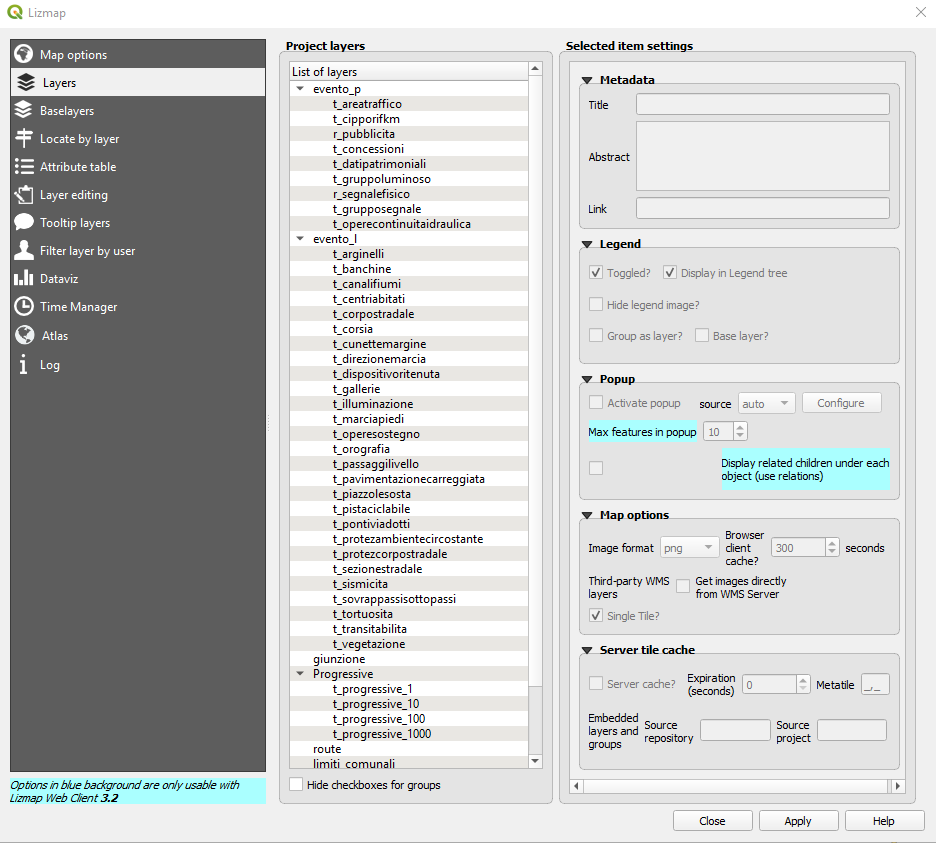

Da qui è possibile definire alcune proprietà dei layer come il titolo che può essere diverso dal nome del layer caricato in Qgis e che verrà visualizzato nell'albero dei layer, se un layer è già attivo (acceso) o meno al caricamento dell'interfaccia web, definire eventuali layer di base tra quelli caricati nel progetto Qgis (es. CTR multiscala della Regione) che verranno quindi visualizzati nel manù dei layer di base nell'interfaccia web, se il layer è interrogabile e quindi attivare un popup cliccando sulle geometrie, ecc.

Layer di base
"""""""""""""""""""""""""""""""""""""""""""
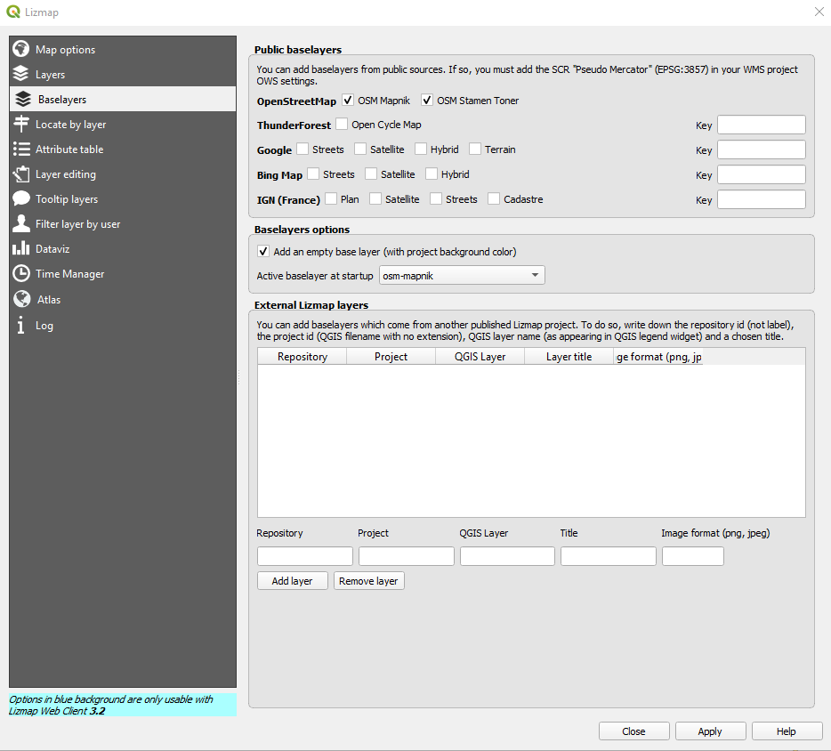

Da qui è possibile definire ulteriori layer di base scegliendo fra alcuni comuni sfondi cartografici come OpenStreetMap (OSM) o Google, Bing ecc. per i quali però è richiesta uan specifica API key.
Inoltre è possibile definire come layer di base altri WMS prodotti con Qgis server e che derivano da altri progetto pubblicati con Lizmap.
E' anche possibile definire se aggiungere un layer di base vuoto e quale layer di base visualizzare al caricamento dell'interfaccia web.

In questo caso sono stati definiti come layer di base OSM Mapnik (a colori) e OSM Toner (in bianco e nero), la CTR multiscala e l' Ortofoto della Regione Emilia Romagna (NB. a causa di limitazioni del WMS dell'ortofoto regionale, questo layer di base al momento non disponibile come sfondo per la stampa).

Locate by layer
"""""""""""""""""""""""""""""""""""""""""""
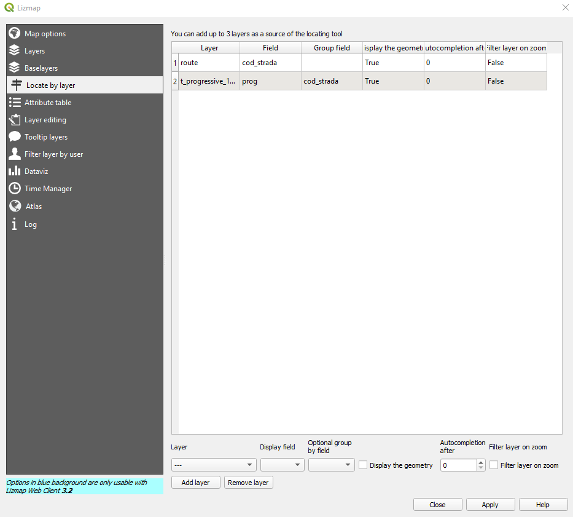

Da qui è possibile definire uno o più layer su cui effettuare delle ricerche ad esempio per una o due specifiche colonne della tabella attributi associata. Per i layer su cui si vuole fare la ricerca per attributo è necessario attivare le WFS capabilities dalle proprietà del progetto Qgis.

In questo caso sono state definite due ricerche:

* sul layer route utilizzando la colonna Codice strada

* sul layer progressive_1000 utilizzando la colonna contenente il numero della progressiva e la colonna Codice strada. In questo caso dall'interfaccia web sarà sufficiente selezionare il codice della strada su cui si vuole fare la ricerca per progressiva e poi il numero della progressiva che si vuole localizzare.

Attribute table
"""""""""""""""""""""""""""""""""""""""""""
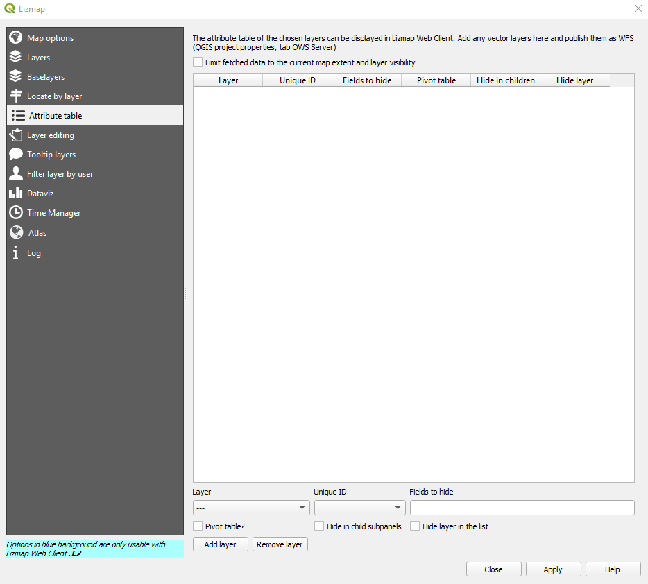

Da qui è possibile definire uno o più layer di cui visualizzare on line la relativa tabella degli attributi. E' sufficiente scegliere dal menù a tendina il layer di cui si vuole visualizzare la tabella attributi e indicare la colonna che contiene il codice identificativo univoco (es. colonna ID) e cliccare sul tasto 'Aggiungi layer'. Per i layer di cui si vuole visualizzare on line la tabbella degli attributi è necessario attivare le WFS capabilities dalle proprietà del progetto Qgis.

Modifica layer
"""""""""""""""""""""""""""""""""""""""""""
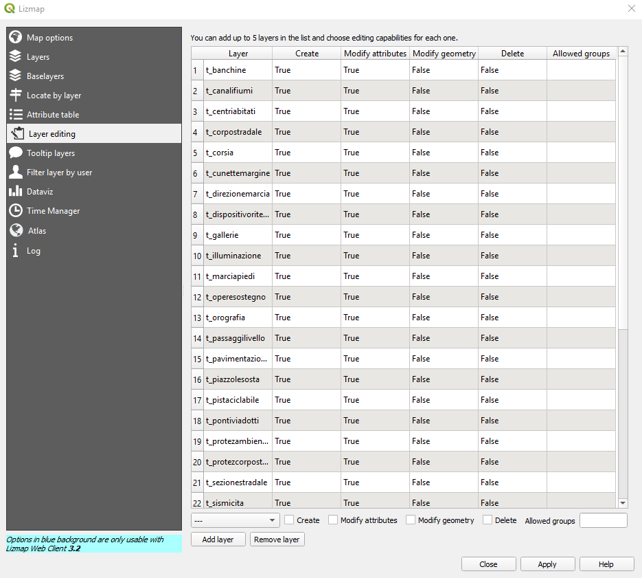

Da qui è possibile definire uno o più layer che possono essere modificati via web. E' sufficiente scegliere dal menù a tendina il layer che si vuole rendere editabile e spuntare la casella corrispondente alle diverse opzioni di editing che si vogliono abilitare (creare nuovi elementi, modificare gli attributi di elementi esistenti, modificare la geometria di elementi esistenti o rimuovere elementi esistenti) e cliccare sul tasto 'Aggiungi layer'. Per i layer per cui si vuole abilitare l'editing on line è necessario attivare le WFS capabilities dalle proprietà del progetto Qgis.

In questo caso la modifica è stata abilitata per tutti i layer degli eventi puntuali e lineari dando la possibilità all'utente di creare nuovi elementi o modificare gli attributi di quelli esistenti.

Come si vede anche dall'immagine sopra, per nessun evento è stata abilitata la funzione di eliminazione delle geometrie e relativi attributi. Dallo strumento webgis infatti è possibile eliminare gli eventi semplicemente inserendo la data di eliminazione. In questo modo l'evento non sarà più visibile on line e sul relativo progetto qgis ma resta comunque salvata nella tabella dell'evento nel database grazie a una funzione di Filtro per data di eliminazione impostata sui layer degli eventi lineari e puntuali dal progetto Qgis.
Pre procedere all'eliminazione effettiva di geometrie, che sono state inserite erroneamente o per testare lo strumento, è necessario caricare dal database, in un nuovo progetto Qgis quindi senza filtri preimpostati, la tabella dell'evento di cui si vogliono rimuovere definitivamente uno o più elementi e selezionare dalla relativa tabella degli attributi la o le righe corrispondenti alle geometrie che si vogliono eliminare.

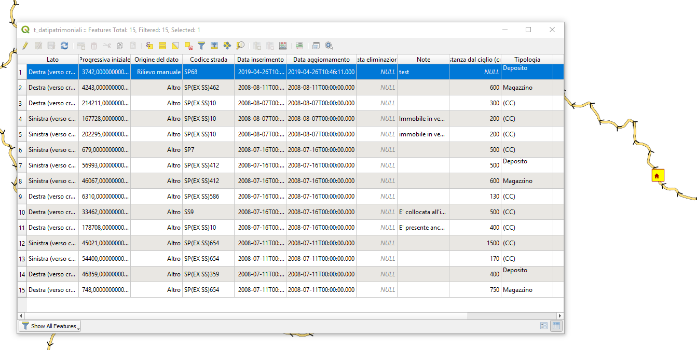

Una volta identificate e selezionate le geometrie da eliminare, è necessario attivare la modalità di modifica cliccando sul pulsante della toolbar della tabella identificato dall'icona con la matita e una volta attivata cliccare sul pulsante 'Elimina le geometrie selezionate' identificato dall'icona del cestino.

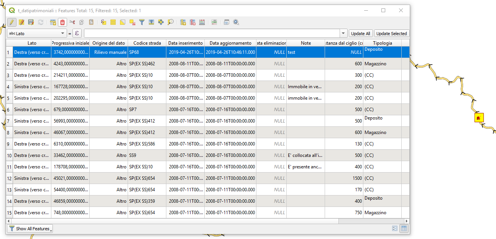

Terminata l'eliminazione è necessario salvare le modifiche premendo sul tasto salva e disabilitare la modalità di modifica premendo il tasto con la matita. Una volta salvate le modifiche le geometrie selezionate saranno eliminate definitivamente.

____________________________________________________________________________________________________________________________

N.B. Per eventuali modifiche al progetto QGIS è sempre fondamentale salvare il progetto al termine della configurazione e
comunque salvare nuovamente anche il file di configurazione lizmap semplicemente aprendo il plugin e cliccando su 'Applica'.
Per eventuali modifiche alle sole configurazioni Lizmap è sufficiente salvare nuovamente il file di configurazione lizmap
cliccando su salva al termine delle modifiche.

Il geodatabase PostgreSQL/PostGIS
---------------------------------------------------
I dati del nuovo Catasto Strade della Provincia di Piacenza sono stati importati in un nuovo geodatabase basato sul software *open source* [PostgreSQL](https://www.postgresql.org/) e sulla sua estensione spaziale [PostGIS](https://postgis.net/).

Il geodatabase contiene tutti i dati del precedente CS che sono stati opportunamente ri-organizzati per garantire una maggiore semplicita.

I dati
"""""""""""""""""""""""""""""""""""""""""""""""""""

Nella fattispecie nel nuovo geoDB i dati sono stati organizzati utilizzando i seguenti schemi, 
ossia delle aree di lavoro dove memorizzare dati della stessa tipologia:

* eventol
* eventop
* geometrie
* normativa
* oracle
* public
* storico

Lo schema *geometrie*
...........................................

Contiene le principali geometrie alla base del CS:

* elementi_stradali: contiene le geometrie degli assi stradali (linee) che partono da una giunzione e arrivano ad un'altra e sono individuate da una prog_ini e da una prog_fin.
* route: contiene le geometrie degli assi stradali unite fra di loro per ogni strada sulla base del cod_strada
* giunzioni che separano gli elementi_stradali sono essenzialmente di due tipi: 
	- confine comunale
	- altro ossia le giunzioni con altre strade provinciali presenti sul CS
	
	
Gli schemi *eventop* e *eventol*
...........................................
Contengono gli eventi rispettivamente puntuali e lineari che sono stati opportunamente suddivisi per garantire una maggiore semplicita. 
Ciascun evento puntuale o lineare che sia, contiene delle tabelle codificate, la cui decodifica e presente nello schema *normativa*.

La riorganizzazione del DB e dettagliata nell'immagine seguente:

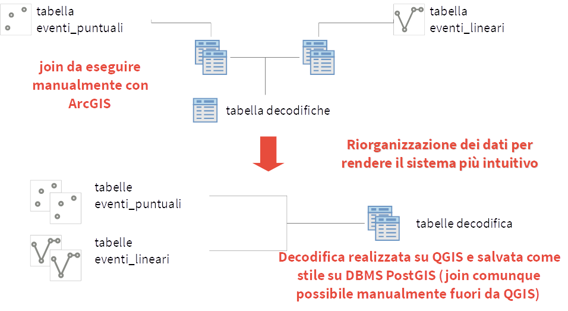

Lo schema *normativa*
...........................................
Contiene, come anticipato, una serie di tabelle non geometriche conenenti le varie decodifiche dei campi delle geometrie (siano esse route, elementi stradali, 
giunzioni, eventi puntuali o lineari, etc.)

Altri schemi
...........................................
Gli altri schemi sono invece di lavoro. In particolare:

* lo schema * public* contiene alcune tabelle e viste "di servizio" usate da PostGIS per la gestione dei dati geografici
* gli schemi *oracle* e *storico* contengono i dati prelevati dal vecchio geodatabase. Nello schema oracle ci sono i dati cosi prelavati in automatico dal precedente geoDB, mentre nello schema storico ci sono alcuni dati non piu utilizzati in quanto ri-organizzati

Gli utenti
""""""""""""""""""""""""""""""""""""""""""

All'interno del DB PostgreSQL sono stati definiti due diversi utenti da utilizzare per chi deve fruire dei dati (oltre all'utente
amministratore che invece in generale non deve venire usato se non per operazioni di manutenzione sul database):

* catasto_strade_editor
* catasto_strade_viewer

Le password sono state comunicate privatamente agli amministratori di sistema.

Lizmap web client
---------------------------------------------------

L'interfaccia amministratore web e basata sul software open source lizmap [repository github] e consente le seguenti operazioni:

* gestione gruppi e utenti 
* gestione delle cartelle dove pubblicare i progetti QGIS chiamate *repository*

Aggiunta gruppi e utenti
"""""""""""""""""""""""""""""""""""""""""""

Sono stati inizialmente configurati tre gruppi di utenti: 

* cs_viewer_group: con permessi di visualizzazione dei repository privati
* cs_editor_group: con permessi di visualizzazione dei repository privati ed editing, laddove configurato
* admins: con permessi di amministratore della piattaforma web e quindi in grado di modificare i suddetti permessi, creare nuovi gruppi e/o utenti etc.

Per ogni gruppo e stato creato un corrispondente utente di default (cs_viewer_group - cs_viewer; cs_editor_group - cs_editor) con password comunicate
privatamente agli amministratori di sistema. Gli amministratori di sistema potranno a loro volta creare nuovi utenti o gruppi a seconda delle esigenze.

Aggiunta/modifica repository
"""""""""""""""""""""""""""""""""""""""""""

Per *repository* si intende una cartella del server dove collocare i progetti QGIS da pubblicare. I progetti andranno salvati in quella cartella e 
tutti i dati utilizzati nei progetti andranno prelevati dal geodatabase PostgreSQL/PostGIS e/o da una o piu sottocartelle interne al repository stesso.
I progetti salvati nella suddetta cartella e dotati del file *.cfg* prodotto dal *plugin lizmap* saranno automaticamente pubblicati su web.

Per ciascun repository si possono definire dei permessi in funzione al gruppo di utenti:

* visualizzare il repository
* visualizzare il link ai geoservizi WMS/WMTS
* editing sui dati (se opportunamente configurato)
* visulizzare i dati completi anche se filtrati
* ????

Sono stati inizialmente configurati due repository: 

* progetti_pubblici
* progetti_privati

