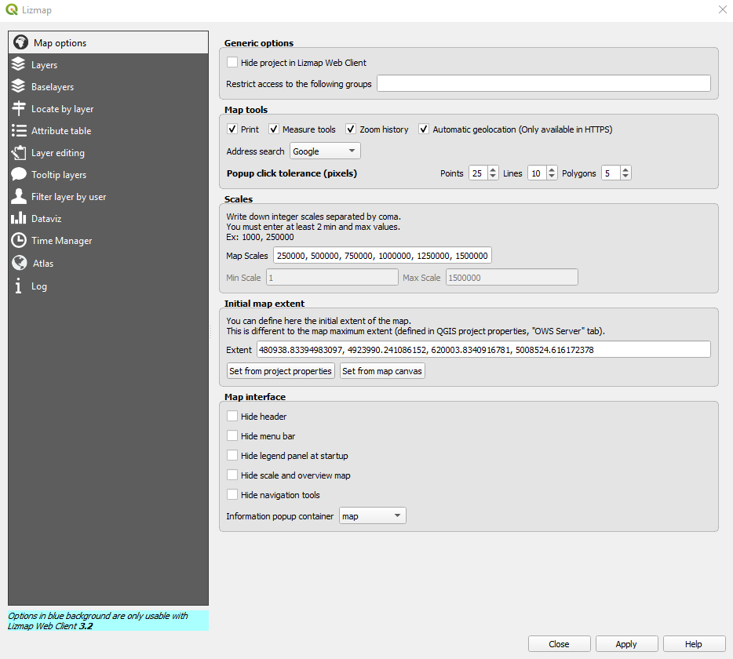

Funzionalità di amministrazione del Catasto Strade
====================================================

Le funzionalità di creazione/gestione di eventi sono possibili solo per il profili di
tipo 1 e 2 (*Amministratore di sistema* e *Responsabile Centrale PC*).

I progetti QGIS
------------------------

Il principio fondamentale su cui si basa il sistema informativo del catasto strade è la possibilità di gestire tramite l'utilizzo di Qgis desktop la pubblicazione e la visualizzazione dei dati sul web. Questo può essere fatto in due modi:

* impostando opportunamente le proprietà del progetto Qgis e dei singoli layer da pubblicare;
* impostando opportunatamente le diverse opzioni proposte dal plugin Lizmap.

A seconda dei diversi contenuti che si vogliono visualizzare on-line, sono stati creati diversi progetti Qgis ognuno corrispondente a una diversa interfaccia web. Qualora si volesse creare un nuovo progetto e quindi la corrispondente visualizzazione web, sarà sufficiente creare appunto un nuovo progetto Qgis, caricare i dati da pubblicare al suo interno, impostare le proprietà del progetto e dei singoli layer e infine utilizzare il plugin Lizmap per procedere alla pubblicazione. In automatico verrà creata la pagina web corrispondente al progetto con tutte le caratteristiche definite tramite le proprietà di Qgis e il plugin Lizmap.
Un eventuale nuovo progetto deve essere salvato all'interno della cartella NuovoCS dove sono state create due cartelle:

* progetti_pubblici: i progetti salvati in questa cartella e configurati per la pubblicazione su web sono accessibili a chiunque accedendo all'interfaccia web;
* progetti_privati: i progetti salvati in questa cartella e configurati per la pubblicazione su web sono accessibili solo attraverso opportune password.

Come già accennato, molte delle caratteristiche dell'interfaccia web possono essere definite impostando le proprietà del progetto e/o dei singoli layer direttamente da Qgis

Proprietà del progetto
"""""""""""""""""""""""""""""""""""""""""""
In Qgis dal menù Progetto selezionare la voce Proprietà, si aprirà una finestra di dialogo da cui selezionare la voce 'Qgis server'

Da qui si possono impostare diverse proprietà che verranno poi trasferite alinterfaccia web salvando il progetto stesso. In particolare da qui è possibile definire:

* Capabilities del Servizio:

Si tratta di informazioni generali come il titolo dello strumento webGIS che può essere diverso da quello del file di progetto Qgis, i dati dell'ente e della persona di riferimento, una breve descrizione, ecc.
Le informazioni inserite in questa finestra di dialogo saranno trasferite allo strumento web una volta salvato il progetto e sranno visibili cliccando sul pulsante 'Informazioni' nella toolbar alla sinistra dello schermo.

.. image:: img/service_cap_web.png

* Capabilities dei servizi WMS:
.. image:: img/wms_cap.png
Da qui è possibile impostare l'estensione della mappa da visualizzare on line, i codici EPSG supportati dai servizi WMS, escludere determinati layer e layout di stampa dalla visualizzazione web, ecc.

* Capabilities dei servizi WMTS:
.. image:: img/wmts_cap.png
Da qui si abilita l'interrogazione dei diversi layer che verranno pubblicati e visualizzati visualizzati nello strumento webGIS. Spuntando le caselle in corrispondenza del progetto tutti i layer caricati al suo interno saranno interrogabili lato web. Agendo invece sui singoli layer sarà invece possibile definire quali rendere interrogabili sul web e quali no.

* Capabilities dei servizi WFS:
.. image:: img/wfs_cap.png
Da qui si abilita la pubblicazione dei singoli layer come servizi WFS che è necessaria per poter utilizzare alcuni tools propri dello strumento webGIS come l'editing on line, sia delle geometrie che delle tabelle associate, e la ricerca.
Anche in questo caso è possibile definire quali layer pubblicare come WFS e quali no. Spuntando le diverse caselle in corrispondenza di ogni layer si abilita la pubblicazione come WFS, la modifica, inserimento e rimozione delle geometrie e relative informazioni alfanumeriche.

Proprietà del layer
"""""""""""""""""""""""""""""""""""""""""""
Una volta caricati i dati all'interno del progetto Qgis, siano essi vettoriali, raster, altri servizi WMS, ecc., vengono visualizzati all'interno del pannello Layers (a sinistra).
L'ordine con cui vengono disposti i diversi layer all'interno del pannello Layers determina l'ordine con cui saranno disposti i diversi layer nell'albero dei layer dell'interfaccia web (si vedano immagini sotto.) Inoltre l'ordine dei layer determina anche l'ordine di visualizzazione in caso di sovrapposizione delle geometrie. In Qgis infatti, il primo layer dall'alto è quello che si sovrappone a tutti gli altri che seguono.

.. image:: img/ordine_layer.png

.. image:: img/ordine_layer_web.png

Nell'esempio delle immagine sopra, il layer 'giunzioni' si sovrappone infatti al layer 'route' e 'limiti_comunali'.

Clickando con il tasto destro del mouse su un singolo layer si accede a un menù dal quale selezionare la voce Proprietà, si aprirà una finestra da cui sara possibile impostare le caratteristtiche principali del layer (es. stile di rappresentazione, limiti di scala nella visualizzazione, caratteristiche della tabella associata per i dati vettoriali, ecc.) che verranno immediatamente trasferite alinterfaccia web salvando il progetto stesso e utilizzando il plugin lizmap.

In particolare dalle proprietà del layer è possibile definire:

* Stile: da questo menù è possibile impostare lo stile grafico con cui verranno rappresentate le geometrie del layer. Si possono creare stili molto semplici ma anche molto complessi, basati ad esempio sui valori univoci di una colonna della relativa tabella degli attributi o definire regole specifiche ad esempio per modificare la rappresentazione delle geometrie a seconda del livello di zoom della visualizzazione. Qualsiasi stile definito, dal più semplice al più complesso, verrà trasferito allo strumento webGIS una volta salvato il progetto Qgis.

.. image:: img/qgis_gish.png

* Etichette: da questo menù è possibile definire le caratteristiche grafiche e i contenuti delle etichette associate alle singole geometrie del layer. Anche in questo caso si possono creare etichette molto semplici (es. scegliendo una colonna della tabella associata come contenuto dell'etichetta) o più complesse (es. utilizzando espressioni e query sui dati per definirne il contenuto). Impostate le varie caratteristiche delle etichette che si vogliono visualizzare (es. contenuto, dimensioni, posizionamento limiti di scala, ecc.) queste saranno trasferite allo strumento webGIS salvando il progetto Qgis.

Ad esempio nel caso del layer dei Cippi di riferimento chilometrico la rappresentazione dell'evento puntuale è data dalla sola etichetta.

* Proprietà dei campi della tabella: da questo menù è possibile consultare le proprietà dei campi che compongono la tabella associata al layer (es. nome, tipologia, dimensione, ecc.). Da qui è possibile aggiungere o rimuovere colonne ma soprattutto, ai fini della pubblicazione web dei dati, è possibile stabilire quali colonne saranno visibili on line interrogando i dati. Per evitare che una o più colonne compaiano nel risultato dell'interrogazione di un elemento sul web è sufficiente deselezionare la casella corrispondente nella colonna 'WMS'.

* Tipologia dei campi della tabella: da questo menù è possibile definire la tipologia della colonna e il metodo di inserimento dei valori. La scelta della tipologia più appropriata per la singola colonna può essere molto importante sia per rendere la consultazione dei dati più semplice, come nel caso delle colonne a cui associare la corrispondente tabella di decodifica, sie per rendere l'editing della tabella più semplice per l'operatore, sia lato desktop che web.

Ad esempio per le colonne di decodifica si è scelta la tipologia 'Mappa Valore' che consente di associare ai valori della colonna quelli della tabella di decodifica, in questo modo in fase di editing sarà sufficiente scegliere la voce desiderata dal menù a tendina che comparirà selezionando la cella che si vuole editare, invece che inserire manualmente il codice numerico o alfanumerico corrispondente alla decodifica.

.. image:: img/value_map.png

Altre tipologia utilizzate sono ad esempio 'Modifica testo' che permette di scrivere manualmente all'interno della cella selezionata, 'Data/Ora' che consente di inserire testi in formato data selezionandoli direttamente da un calendario che comparirà selezionando la cella, 'Nascosto' che permette di nascondere la colonna in fase di editing del dato.
Da qui inoltre è possibile definire se una colonna è modificabile, se può contenere valori nulli, un alias per il nome della colonna, ecc.
Anche in questo caso tutte le caratteristiche definite per le singole colonne della tabella associata al singolo layer saranno trasferite allo strumento webGIS una volta salvato il progetto Qgis.

* Visualizzazione: da questo menù è possibile limitare la visualizzazione del layer a un certo range di scala. Ad esempio la visualizzazione degli eventi puntuali è stata impostata tra la scala 1:25000 e 1:1 mentre quella degli eventi lineari tra 1:50000 e 1:1. Ciò significa che per scale maggiori dell'1:25000 non sarà possibile visualizzare e interrogare i layers degli eventi puntuali mentre per scale superiori all'1:50000 non sarà possibile visualizzare e interrogare i layers degli eventi lineari.
Anche in questo caso eventuali limiti di visualizzazione dipendenti dalla scala per i singoli layers saranno trasferiti allo strumento webGIS una volta salvato il progetto Qgis.

Il plugin lizmap
-----------------------------------
Un altro strumento che consente di gestire la pubblicazione e visualizzazione web dei dati tramite Qgis è il plugin Lizmap che può essere facilmente installato dal menù plugin.
Il plugin Lizmap consente di impostare tutte le proprietà, strumenti, e funzioni che non vengono già impostate tramite le proprietà del progetto o dei layer, infatti dal qui si definiscono soprattutto le caratteristiche dello strumento webGIS.

Opzioni di Mappa
"""""""""""""""""""""""""""""""""""""""""""

Da qui è possibile attivare alcuni strumenti per lo strumento webGIS come gli strumenti di misura (lunghezza, area e perimetro), la stampa, ecc. In particolare lo strumento stampa consente di stampare immagini in scala e in diverso formato direttamente dall'interfaccia web. Lo strumento utilizza i layout di stampa definiti da qgis per il progetto mantenendone tutte le caratteristiche (es. dimensione della pagina, impaginazione, legenda, cartiglio, ecc.).
Sempre dalle Opzioni di Mappa è anche posibile definire un set di scale predefinite per la visualizzazione e la stampa e l'estensione iniziale della mappa che può essere diversa da quella impostata dalle proprietà di progetto. L'estensione iniziale infatti può essere impostata dalle proprietà del progetto oppura dall'area di mappa del prgetto Qgis, in questo caso sarà necessario zoommare sull'area che si intende visualizzare al caricamento dello strumento webGIS e scegliere dal plugin Lizmap l'opzione 'imposta dall'area di mappa'.
Da qui è inoltre possibile definire alcune caratteristiche dell'interfaccia web come visualizzare o meno la barra dei menù, la mappa di navigazione, la scala, ecc. e inoltre è possibile scegliere dove visualizzare i risultati dell'interrogazione dei dati (es. popup sulla mappa o pannello dedicato).

Lizmap web client
---------------------------------------------------

aaa

Aggiunta gruppi e utenti
"""""""""""""""""""""""""""""""""""""""""""

Aggiunta/modifica repository
"""""""""""""""""""""""""""""""""""""""""""

