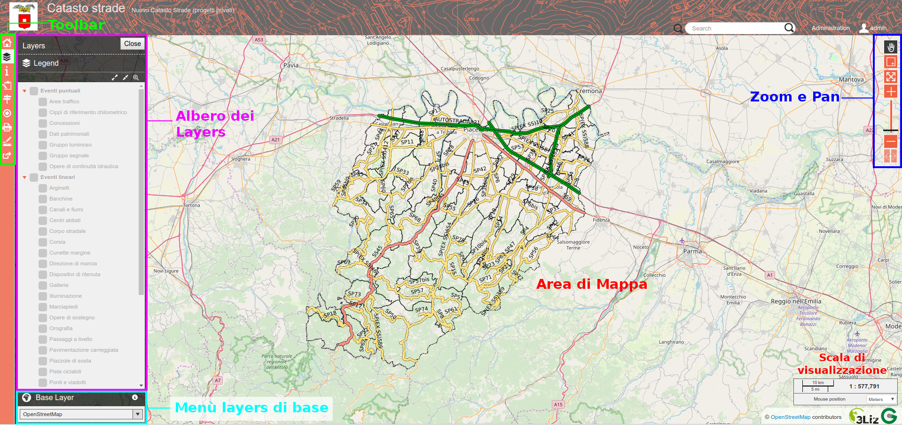
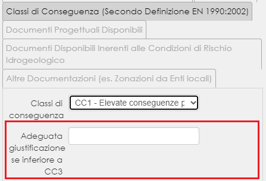
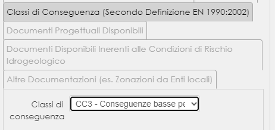
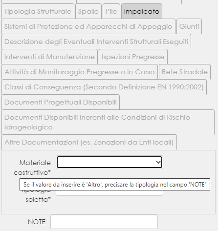
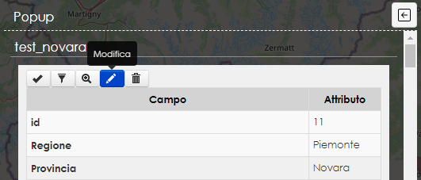
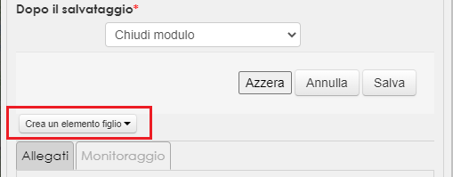

Fruizione dell'interfaccia web
==================================

L'interfaccia web del nuovo strumento webGIS per la gestione del Catasto Strade è semplice, intuitiva e di facile utilizzo.

E' composta principalmente dall'area di mappa dove vengono visualizzati i dati, due toolbar da cui si accede alle principali funzionalità (es. stampa, editing, strumenti di misura e ricerca, ecc.) o agli strumenti di zoom e pan, l'albero dei layer da cui è possibile accendere/spegnere i singoli layer o l'intero gruppo, che verranno automaticamente visualizzati nell'area di mappa, e un menu da cui selezionare lo sfondo cartografico da visualizzare in area di mappa.

Funzionalità di base
-----------------------------

.. raw:: html

    

        <iframe src="https://www.youtube.com/embed/QkhGyZk2Juc" frameborder="0" allow="accelerometer; autoplay; encrypted-media; gyroscope; picture-in-picture" allowfullscreen style="position: absolute; top: 0; left: 0; width: 100%; height: 100%;"></iframe>
    

"""""""""""""""""""""""""""""""""""""""""""""""
    

Ricerca per attributo
-----------------------------

.. raw:: html

    

        <iframe src="https://www.youtube.com/embed/_BfZ0XfndTw" frameborder="0" allow="accelerometer; autoplay; encrypted-media; gyroscope; picture-in-picture" allowfullscreen style="position: absolute; top: 0; left: 0; width: 100%; height: 100%;"></iframe>
    

    
"""""""""""""""""""""""""""""""""""""""""""""""

Stampa
-----------------------------

.. raw:: html

    

        <iframe src="https://www.youtube.com/embed/DGpLJkqav9Q" frameborder="0" allow="accelerometer; autoplay; encrypted-media; gyroscope; picture-in-picture" allowfullscreen style="position: absolute; top: 0; left: 0; width: 100%; height: 100%;"></iframe>
    

    
"""""""""""""""""""""""""""""""""""""""""""""""
    
Misura
-----------------------------

.. raw:: html

    

        <iframe src="https://www.youtube.com/embed/Rnkttf-Z2nk" frameborder="0" allow="accelerometer; autoplay; encrypted-media; gyroscope; picture-in-picture" allowfullscreen style="position: absolute; top: 0; left: 0; width: 100%; height: 100%;"></iframe>
    

"""""""""""""""""""""""""""""""""""""""""""""""

Tabella attributi e selezione
-----------------------------

.. raw:: html

    

        <iframe src="https://www.youtube.com/embed/7kGRwqG4Aqs" frameborder="0" allow="accelerometer; autoplay; encrypted-media; gyroscope; picture-in-picture" allowfullscreen style="position: absolute; top: 0; left: 0; width: 100%; height: 100%;"></iframe>
    

"""""""""""""""""""""""""""""""""""""""""""""""

Editing eventi puntuali e lineari
-----------------------------

Per accedere agli strumenti di editing dello strumento webGIS del Catasto Strade è necessario fare il login con il proprio utente e password. Solo alcuni utenti hanno i permessi necessari per poter procedere alla modifica e aggiunta on line degli eventi puntuali e lineari, quindi solo questi utenti, una volta loggati, potranno visualizzare e utilizzare gli strumenti di editing.

Una volta entrati con il proprio utente, qualora si abbiano i permessi per la modifica on line, saranno disponibili tre pulsanti nella toolbar laterale:

* Edition: consente l'editing sia degli elementi puntuali che di quelli lineari a partire dalla geometria che deve essere disegnata dall'operatore sulla mappa
* Nuovo evento puntuale: consente di aggiungere un nuovo evento puntuale a partire dalla progressiva della strada relativa
* Nuovo evento lineare: consente di aggiungere un nuovo evento lineare a partire dalle progressive iniziale e finale dell'evento

Edition tool
""""""""""""""""""""""""""""""""
E' sufficiente selezionare dal menù a tendina il layer a cui si vuole aggiungere un nuovo evento puntuale o lineare e premere il tasto "Add". Una volta selezionato il layer si potrà procedere a disegnare la geometria sulla mappa.
In caso di eventi puntuali con un solo click del mouse si crea la nuova geometria che potrà essere spostata tenendo premuto il tasto sinistro del mouse. Per quanto riguarda invece gli eventi lineari, cliccando con il mouse sulla mappa si crea la nuova geometria lineare, a ogni click del mouse corrisponde un nuovo vertice della geometria lineare, con il doppio click del mouse viene terminato l'editing della geometria. Modificando un veneto lineare si attivano inoltre alcuni strumenti di editing che permettono di spostare i singoli vertici della geometria lineare, traslarla, ruotarla e modificarla eliminandone una parte.

Sullo strumento webGIS non sono implementate funzioni di snap, in fase di editing non è quindi possibile "agganciarsi" precisamente alle geometrie di route disegnando i nuovi eventi puntuali o lineari. Per ovviare quindi al problema di nuovi eventi non perfettamente collocati sulle route sono stati implementati lato database delle funzioni (triggers) che collocano punti e vertici degli elementi lineari esattamente sulle geometrie di route spostando la geometria disegnata dall'operatore sul punto più vicino della geometria route.

Una volta disegnata la geometria si può procedere alla compilazione della tabella degli attributi relativa alla geometria appena disegnata. A seconda dell'evento che si sta modificando, si possono riempire i diversi campi della tabella inserendo manualmente l'informazione o scegliendola da menù a tendina in caso di colonne con relativa decodifica.
Altre colonne come ad esempio 'data inserimento', 'data aggiornamento' o 'utente ultima modifica' non sono editabili in quanto vengono automaticamente riempite dal database al momento del salvataggio delle modifice. Nel caso ad esempio dell'evento lineare 'ponti e viadotti' è possibile caricare nelle colonne 'scheda vincolo' e 'scheda tecnica' allegati in formato pdf e nella colonna 'Foto' delle immagini semplicemente cliccando sul pulsante che peremette di scegliere il file dal proprio pc.
Qualora le colonne definite obbligatorie lato progetto Qgis non venissero compilate, lo strumento restituirà un errore non permettendo all'operatore di salvare le modifiche.

Terminato il disegno geometrico e compilata la tabella è possibile salvare il nuovo elemento premendo sul pulsante salva. Una volta salvata sarà immediatamente visibile sulla mappa.

Nuovo evento puntuale
""""""""""""""""""""""""""""""""
Con questo strumento è possibile aggiungere nuovi eventi puntuali a partire dalla progressiva su cui si vuole collocare il nuovo evento. Anche in questo caso è sufficiente selezionare il layer da modificare e cliccare sul pulsante 'Compila attributi evento', varrà quindi visualizzato il form relativo alla tabella attributi dell'evento che si sta modificando e anche in questo caso sarà possibile riempire i singoli campi con le stesse modalità descritte per lo strumento precedente (es. compilazione manuale, menù a tendina, ecc.).
Con questo strumento non si deve disegnare la geometria sulla mappa ma è necessario inserire il numero della progressiva su cui si vuole collocare il nuovo evento puntuale e il codice strada.

Nuovo evento puntuale
""""""""""""""""""""""""""""""""
Con questo strumento è possibile aggiungere nuovi eventi lineari a partire dalla progressiva di inizio e fine del evento. Anche in questo caso è sufficiente selezionare il layer da modificare e cliccare sul pulsante 'Compila attributi evento', varrà quindi visualizzato il form relativo alla tabella attributi dell'evento che si sta modificando e anche in questo caso sarà possibile riempire i singoli campi con le stesse modalità descritte per lo strumento precedente (es. compilazione manuale, menù a tendina, ecc.).
Con questo strumento non si deve disegnare la geometria sulla mappa ma è necessario inserire il numero della progressiva di inizio e di fine del nuovo evento lineare e il codice strada e automaticamente verrà creata una nuova geometria lineare con inizio e fine nelle progressive indicate e con l'andamento del tratto di route identificata dal codice strada indicato.

Modifica degli attributi e eliminazione delle geometrie esistenti
""""""""""""""""""""""""""""""""""""""""""""""""""""""""""""""""""
Per modificare gli attributi di un evento puntuale o lineare esistente è sufficiente identificare l'evento che si vuole modificare dallo strumento tabella attributi o semplicemente cliccandoci sopra con il mouse e cliccare sul tool edit (identificato dall'icona con la matita) che compare nella toolbar alla riga della tabella corrispondente all'evento che si vuole modificare o nella toolbar del popup che si apre cliccando dalla mappa sull'evento. Una volta attivato lo strumento edit per il singolo elemento sarà possibile modificarne gli attributi contenuti nella tabella.

Seguendo la stessa procedura descritta sopra si può anche procedere all'eliminazione di un elemento. In questo caso una volta attivato lo strumento Edit è sufficiente inserire in corrispondenza del campo 'Data eliminazione' la data in cui viene eliminato l'elemento servendosi del calendario che compare cliccando sull'apposito pulsante. Una volta inserita la data di eliminazione e salvate le modifiche, l'evento eliminato non sarà più visualizzato.

NB. Con questa procedura di eliminazione la geometria non viene più visualizzata sia nello strumento webGIS che nel progetto Qgis ma la geometria resta comunque salvata nel data base. Per procedere all'effettiva eliminazione dell'evento (es. in caso di errori grossolani, test o altro) rivolgersi agli amministratori di sistema del Servizio Strade della Provincia di Novara).

.. raw:: html

    

        <iframe src="https://www.youtube.com/embed/iz5LkQ-sTRs" frameborder="0" allow="accelerometer; autoplay; encrypted-media; gyroscope; picture-in-picture" allowfullscreen style="position: absolute; top: 0; left: 0; width: 100%; height: 100%;"></iframe>
    

Ponti e Viadotti - note compilazione form
""""""""""""""""""""""""""""""""""""""""""""""
**Istruzioni**

La tabella attributi del layer del layer “Ponti e Viadotti” è stata redatta seguendo il modello della “Scheda di censimento ponti di Livello 0” del Ministero delle Infrastrutture e della Mobilità Sostenibile  (link: https://www.mit.gov.it/sites/default/files/media/notizia/2020-05/3_All_A_Scheda_censimento_ponti.pdf) . 

Con il fine di semplificare la fruibilità del form di compilazione, questo è stato impostato per essere a "visibilità dinamica” quando si è in presenza campi “dipendenti”, cioè che hanno senso di essere compilati solo nel caso sia compilato un altro campo (o più semplicemente spuntato), o nel caso in cui quest'ultimo assuma uno specifico valore. Così facendo, si sono nascosti i “campi dipendenti”, i quali vengono visualizzati solo al verificarsi di una particolare condizione sul campo da cui “dipendono”. Questo è il caso di specificazioni e note aggiuntive.

Prendendo ad esempio il gruppo “Classi di Conseguenza (Secondo Definizione EN 1990:2002)”, come possiamo vedere nelle immagini sotto riportate, il campo “Adeguata giustificazione se inferiore a CC3” compare solo se il campo “Classi di conseguenza” assume i valori “CC1” e CC2”, ma non nel caso assuma valore “CC3”.

  

Inoltre, per aiutare la compilazione, si sono aggiunti dei tooltip al passaggio del mouse su alcuni campi (contraddistinti da un asterisco nero "*" in fondo al nome), con suggerimenti e note informative. 

Per poter aggiungere tutte quelle informazioni che non trovano spazio nei campi presenti, si è inserito in fondo al form il campo “note”.

È stata necessaria la creazione di una “tabella figlia” per gli allegati, considerando come “tabella padre” il layer “Ponti e Viadotti”. Questo è stato fatto principalmente per due motivi: a) natura di alcuni dati, che potrebbero essere multipli per la stessa geometria; b) per una migliore organizzazione del form. 

Non è possibile però popolare “la tabella figlia” mentre si crea la geometria, ma bisogna agire in un secondo momento. Per fare ciò, si seleziona la geometria con il mouse e si clicca “Modifica” (icona con la matita) dal popup.

Si aprirà il form di compilazione degli attributi, ma questa volta in fondo alla pagina saranno presenti le tabelle figlie e attraverso un menù a tendina sarà possibile selezionarle e modificarle.

**ATTENZIONE**: per cancellare una geometria, sarà prima necessario cancellare i dati nelle tabelle figlie, se questi sono prsenti.
